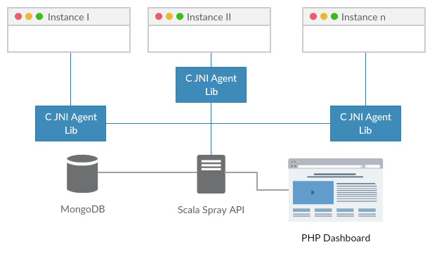
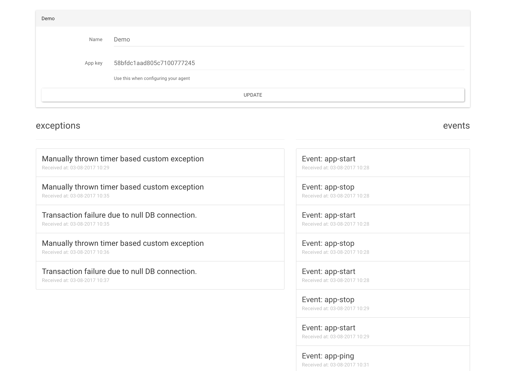

#  BSc Dissertation Project - University of Manchester - Non-intrusive JVM agents for capturing the internal state of live production applications

[](https://github.com/nenuadrian/c-java-native-interface-agent-stack-trace-heap-capture/actions/workflows/cmake-single-platform.yml)
[](https://github.com/nenuadrian/bsc-dissertation-c-java-native-interface-agent-stack-trace-heap-capture/actions/workflows/main.yml)

## Overview
This repository contains the implementation of a C JNI Agent designed to recursively capture the values of objects within methods on a stack trace.



## Prerequisites
To utilize this agent, you need to install the following libraries:
- `libxml2`
- `crypto`
- `openssl`

## Installation and Usage
1. **Building the JNI Agent**:
   Compile the JNI agent and generate the library files.
   
2. **Running with Java**:
   Incorporate the resulting library files using the Java command's `-agentpath` flag.

## Scala Spray Server Integration
This agent interfaces with a basic Scala Spray server to record captured values in MongoDB.

### Configuration
- Modify the `src/main/resources/application.conf` file to configure the server settings.
- Build and run the server using `sbt run`.

## FuelPHP Dashboard



A FuelPHP dashboard displays the analysis results by communicating with the Scala Spray server.

### Setup
- Perform `composer install` to set up the FuelPHP dashboard.

## Note
This implementation serves as a Minimum Viable Product (MVP). It is not stable, secure, or optimized. However, relevant code snippets can be extracted and used, especially those demonstrating communication with the JNI.

## Disclaimer
This was academic research, and no guarantees or maintenance are provided.

# Cite

```
@article{jniAgents,
	author = {Adrian Nenu and Caroline Jay},
	title = {{Non-intrusive JVM agents for capturing the internal state of live production applications}},
	url = {https://github.com/nenuadrian/bsc-dissertation-c-java-native-interface-agent-stack-trace-heap-capture},
	year = 2017
}
```
